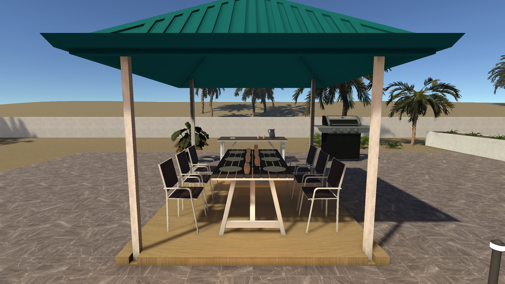
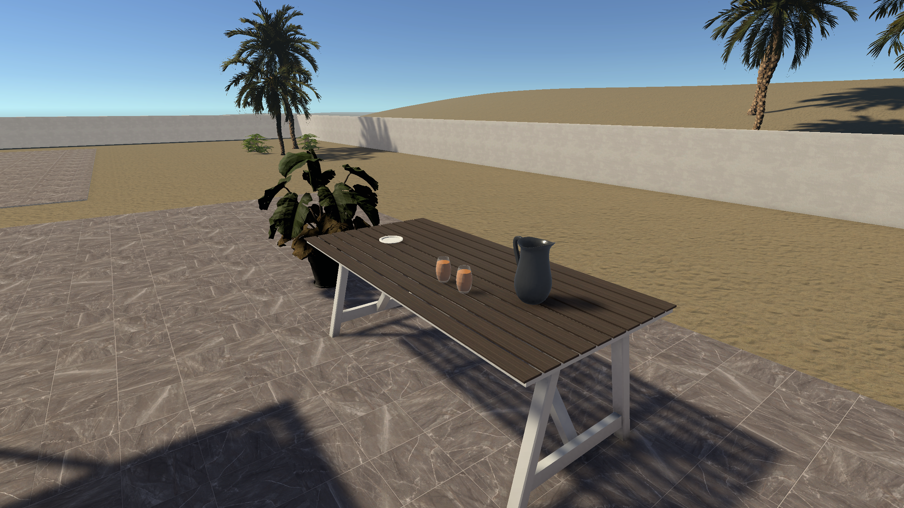

# 야외 식사 공간 배치 개선

베이크와 실제 러버덕 수집 거리·판정은 전체 배치 이후에 진행한다. 이번에는 수영장 휴식 공간에 이어 기존 정자와 바비큐 주변 한 구역만 수정했다.

## 실제 변경

- 씬: `Assets/Modern Villa/Scenes/Beach Villa.unity`
- 에디터 도구: `Assets/_Project/Editor/BeachVillaDiningPass.cs` 및 `.meta`
- 기존 식탁 1개와 의자 6개의 지지면을 실제 정자 데크 높이 0.15m에 맞췄다. 의자는 식탁을 향한 원래 방향을 유지하면서 간격을 좁혔다.
- 기존 접시 6개와 음료 잔 6개를 새 상판 높이에 맞추고, 잔을 접시 옆으로 정리했다.
- 바비큐의 떨어진 손잡이와 바퀴를 두 LOD에서 각각 6개씩 수정했다. 정상 부품과 실제 공유 메시를 비교해 씬 인스턴스에만 변형을 기록했다.
- 진입 축의 기존 바닥 조명을 정자 모서리로 이동했다.
- `Beach Villa - Outdoor Dining Detail` 아래 준비대, 주전자, 잔 2개, 접시 3개, 화분을 기존 프리팹의 원래 크기로 배치했다. 접시 더미는 의도된 겹침이다.
- 기존 수영장 보고서에서 베이크·수집 확인을 다음 구역의 선행 조건이 아닌 전체 배치 이후 항목으로 정리했다.

원본 프리팹·메시·공유 재질을 덮어쓰지 않았다. 새로운 바닥이나 런타임 생성 시스템을 추가하지 않았다. 플레이어·카메라·UI·러버덕 데이터를 수정하지 않았다.

## 구성 의도

수영장에서 동쪽 출입구로 접근해 식탁을 살피고, 서쪽으로 돌아 준비대와 바비큐를 둘러보는 흐름이다. 준비대의 음료와 접시가 식사 공간의 용도를 설명하고, 화분은 준비대 끝을 구분한다. 의자 뒤와 준비대 앞은 이동 공간으로 남겼다.

탐색 후보는 준비대 끝 화분 옆, 준비대 다리 바깥, 정자 가장자리다. 실제 러버덕은 배치하거나 옮기지 않았고 수집 가능 판정은 이번 범위에서 제외했다.

## 검사 결과

- 같은 세 시점의 수정 전·후 렌더를 확인했다: `before/after-overview`, `before/after-approach`, `before/after-service`.
- 실제 플레이어 카메라로 Play 화면 두 장을 확인했다: `play-approach.png`, `play-service.png`. 캡처 후 원래 플레이어 위치·시점을 복구했다.
- 기존 CharacterController(높이 1.8m, 반경 0.28m)로 수영장 연결, 양쪽 출입구, 의자 뒤, 준비대 통로, 바비큐 작업면을 양방향 검사했다. Edit/Play 각각 12개 경로 모두 통과했으며 검사 중 카메라 주변 충돌은 없었다.
- 식탁·의자 7개의 바닥 접촉 오차 0m. 기존 접시·잔 12개의 상판 여유는 0.001m. Bounds 외에 실제 데크와 상판 메시 및 화면도 확인했다.
- 최초 Play 검사에서 런타임 정적 배칭으로 원본 메시 좌표 검사에 오류가 발생했다. 해당 검사는 Edit 모드로 한정하고 Play에서는 실제 충돌체 이동과 시각 검수를 다시 수행했다.
- 수정 직전 백업과 씬 비교: 기존 직렬화 문서 22개 변경(해당 가구 프리팹 21개와 씬 루트 목록), 18개 추가, 삭제 0개. `scope-audit.json`에 ID를 기록했다.

## 범위와 후속 작업

코드 작성과 씬 반영, 지정 시점의 시각 검수를 완료했다. 이동 검사는 지정 경로의 표본이며 모든 접근 각도와 전체 맵 성능을 보증하지 않는다. 조명 베이크와 수집 거리 판정은 수행하지 않았다. 이번 구역에서 다음 배치 작업을 막는 문제는 발견하지 못했다.

Unity `Rubber > Outdoor Dining` 메뉴에 조사·적용·검사 기능이 있다. 적용 마커가 이미 있으면 다시 생성하지 않고 수동 편집을 보존한다. 모든 배치는 일반 씬 인스턴스로 수정할 수 있다. 기존 BeachVillaExpansion과 BeachVillaLayoutPass도 기존 구역 마커가 있으면 최초 생성 실행을 차단하므로 이번 배치를 재생성으로 덮어쓰지 않는다. 이번 적용 메뉴도 재실행하여 중복 생성 없이 기존 편집을 유지하는 것을 확인했다.

