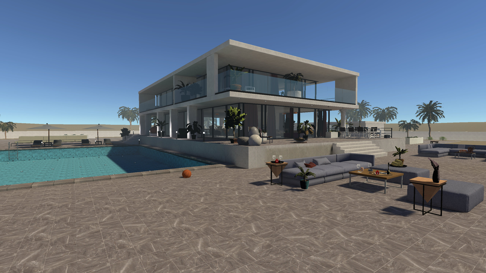
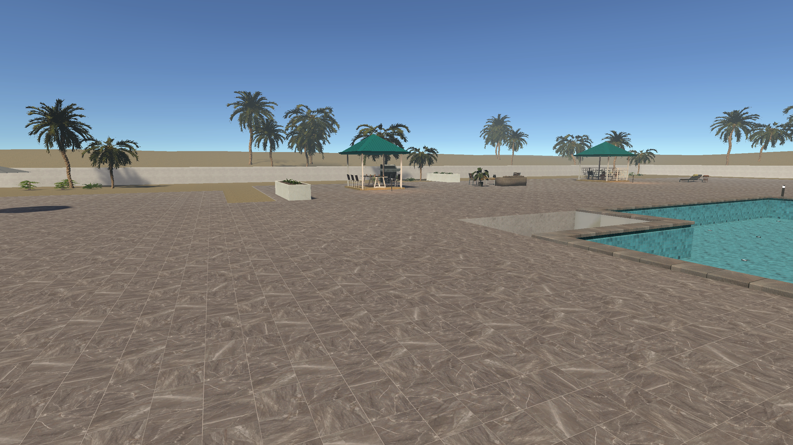
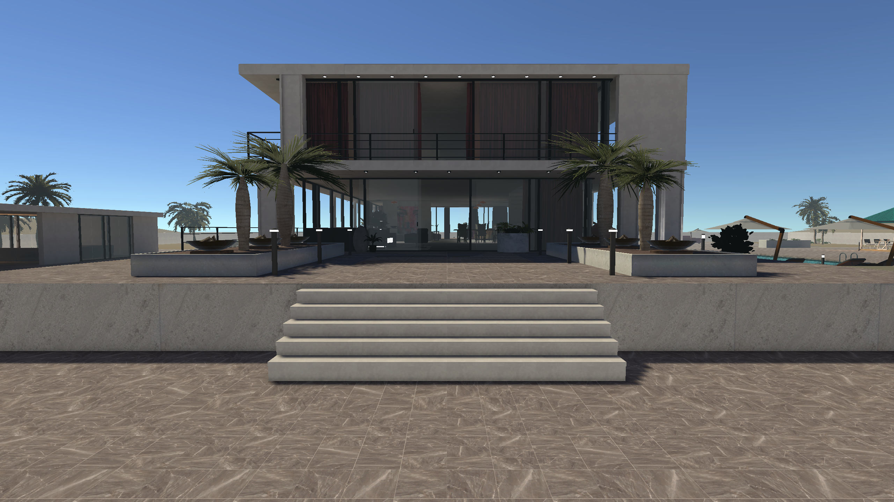
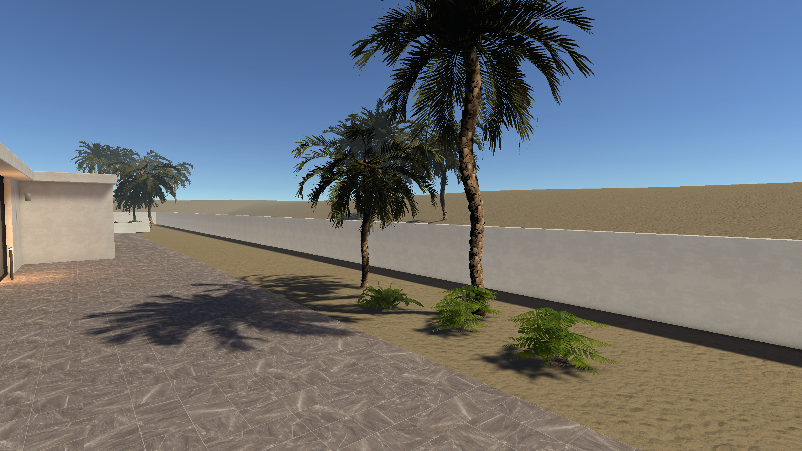
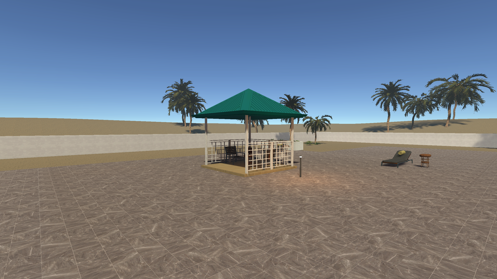
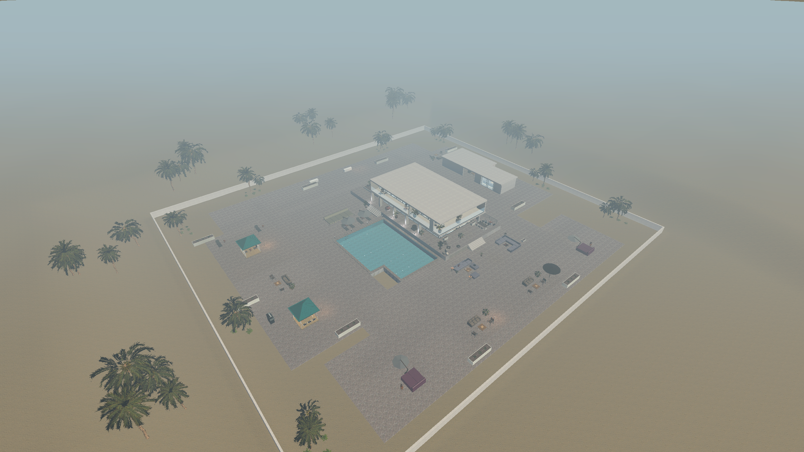
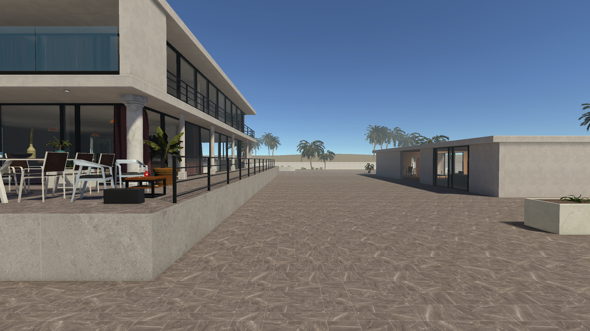

# 시작 구간·지면·정원 배치 재검토

기존 Beach Villa 씬에 저장했다. 이전 배치 검토본에서 지적된 높이와 공간 용도 문제를 수정한 기록이다. APV, 라이트맵, 재질, 쉐이더 작업은 진행하지 않았다.

## 바뀐 구조

- 외부 포장은 높이 0.05m, 식재용 흙은 0.025m로 정리했다. 기존 낮은 테라스와 수영장 주변 데크를 새 포장과 직접 연결했고, 중앙 외부 구역 아래의 오래된 지형 함몰을 없앴다. 수영장 내부는 별도로 낮게 유지했다.
- 시작점은 좁은 데크 가장자리에서 넓은 수영장 진입 공간으로 옮겼다. 이전 시작 위치도 평평한 바닥으로 연결했다.
- 본관은 기존 1m 높이의 기단을 유지한다. 용도가 사라진 뒤쪽 낮은 계단 두 단계를 정리하고, 앞뒤에 본관으로 올라가는 4m 폭의 계단을 배치했다. 높은 쪽이 건물을 향하도록 실제 단 높이를 검사했다. 수영장 옆 본관 연결 계단과 실내 층간 계단은 유지한다.
- 동쪽 통로를 막던 기존 정자와 옛 지형용 지지대를 비활성화했다. 본관 앞 식탁, 소파, 낮은 테이블과 화단을 이동하거나 정리해 통로를 확보했다.
- 지면과 맞지 않던 기존 야자수 5개를 비활성화했다. 확장 구역 야자수 40개는 실제 메시의 최하단을 조사해 흙 아래 2.5cm에 심었다. 안쪽 16개는 포장 밖 흙 띠에 배치했고, 포장 위에 남은 낮은 식물도 흙으로 이동했다. 기존 화분 속 야자수는 유지했다.
- 정원의 자쿠지와 큰 스파 건물을 없애고, 작은 정자 아래 의자 두 개와 테이블이 있는 휴게 공간으로 바꿨다. 본관 상층의 노출된 자쿠지도 비활성화했다.

## 검증과 최적화

중앙 외부 구역을 25cm 간격으로 검사한 결과 바닥 누락 0, 기준 높이 아래로 내려가는 지점 0, 확인된 바닥 높이 최소·최대 모두 0.05m다. 이 검사는 본관과 수영장 내부를 제외한다.

시작점, 이전 시작점, 본관 동서 통로, 남북 연결, 앞뒤 출입 계단의 8개 경로를 양방향으로 검사했다. 총 16개가 도착 거리와 도착 높이 검사를 통과했다. 평지 경로의 최대 한 프레임 하강은 초기 착지에 해당하는 2cm이고, 계단 하강 경로는 4.2cm였다. 전체 맵의 모든 이동 조합을 검증했다는 뜻은 아니다.

기존 에셋의 공유 메시·재질과 LOD를 유지했다. 교체한 바닥·스파 건물·불필요한 충돌체는 비활성화해 중복 렌더링과 충돌을 피했다. 야자수 충돌은 실제 줄기 위치의 단순 캡슐을 사용한다. 추가 실시간 광원이나 프레임마다 실행되는 지면 검사 코드는 만들지 않았다. 1080p/60FPS 성능은 이번에 측정하지 않았다.

## 검토 화면

기존 베이크 조명 때문에 일부 이전 그림자나 어두운 가구가 남아 있다. 배치 승인 전에는 재베이크하지 않는다. 원본 복구용 씬 사본은 `BeforeRepair.unity.backup`, 검사 결과는 `validation.txt`, 야자수 밑동 측정은 `tree-roots.tsv`에 있다.
