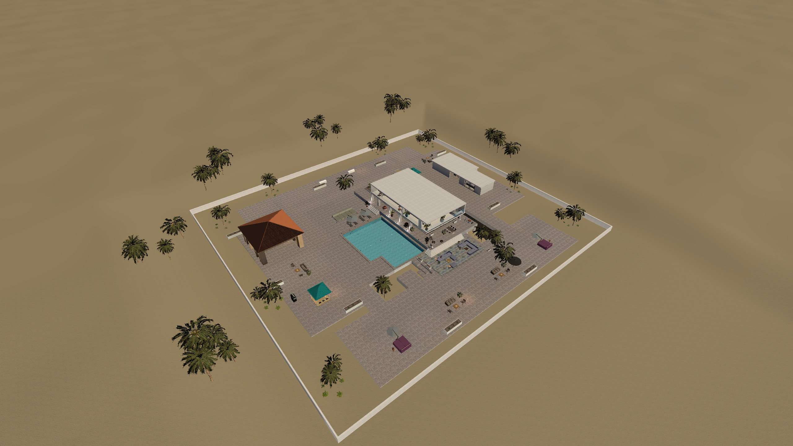
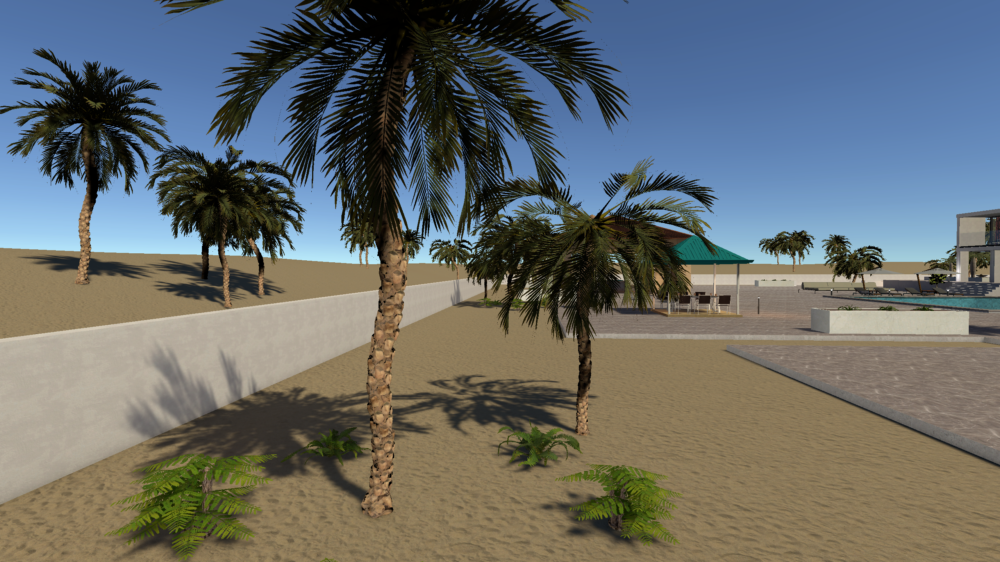
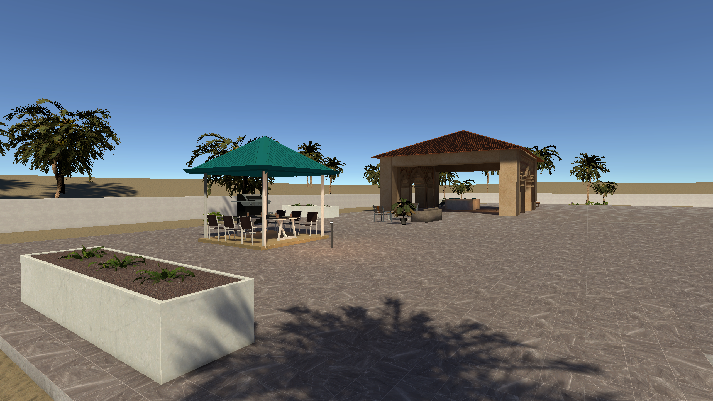
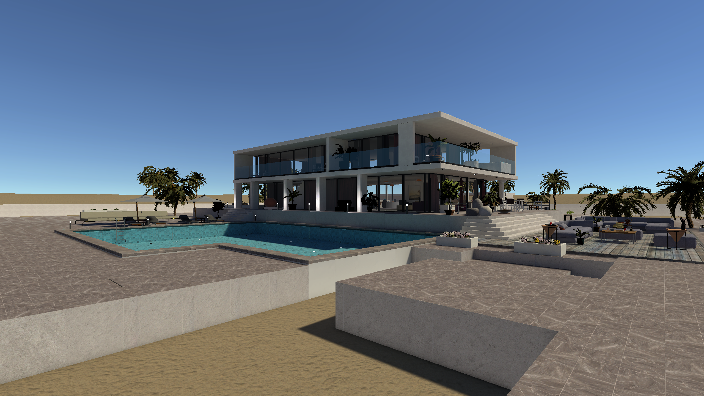
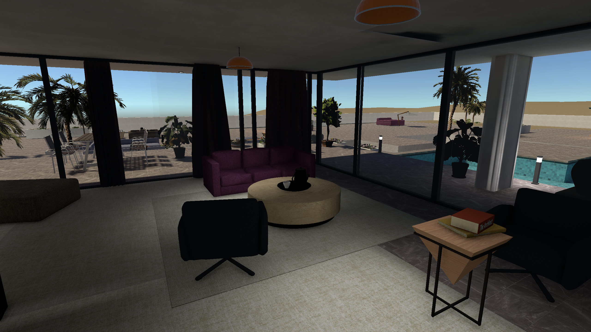
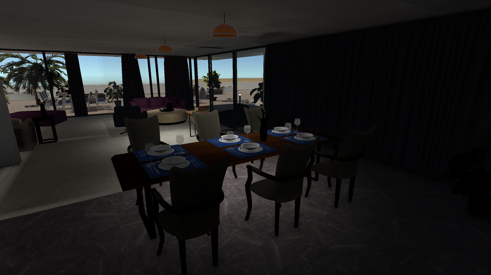
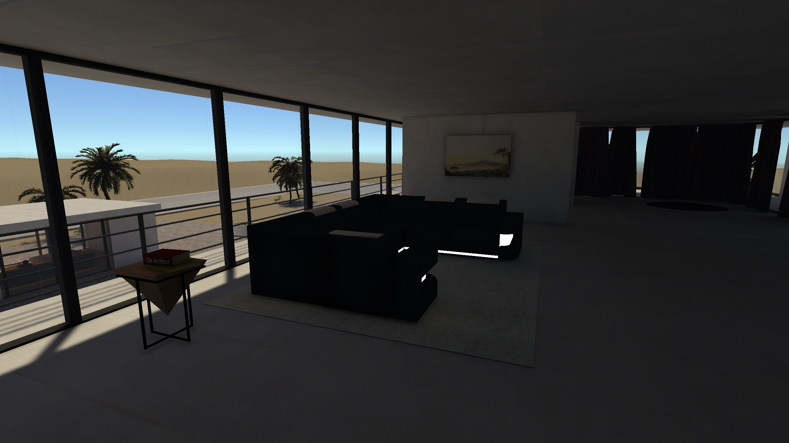
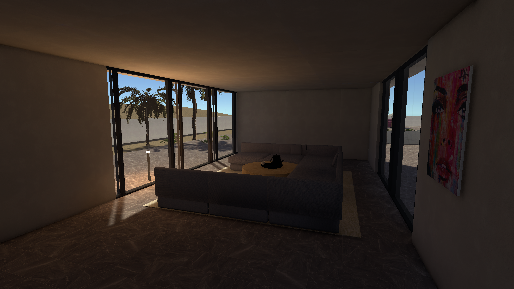
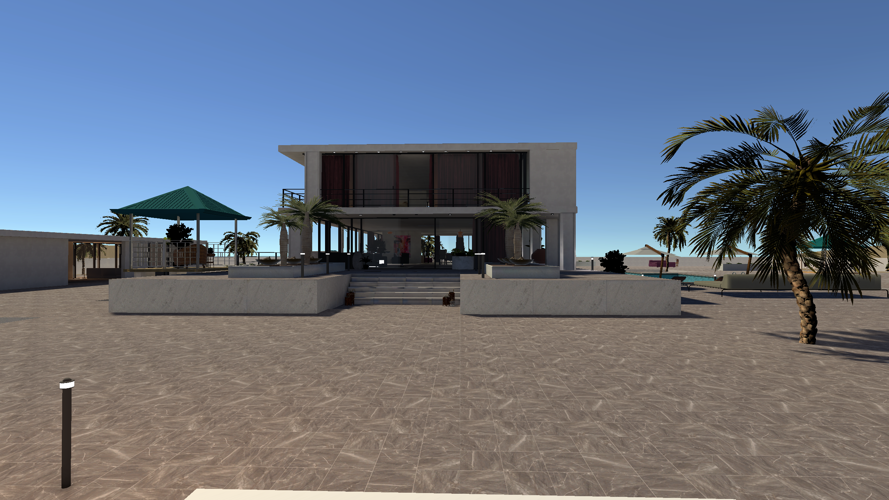

# 비치 빌라 배치 검토본 — 2026-09-28

> 이 문서는 이전 배치 기록이다. 바닥 높이·시작점·야자수·욕조에 대한 후속 수정은 [지면 및 정원 재검토](../BeachVillaGroundRepair/README.md)를 참고한다.

기존 `Assets/Modern Villa/Scenes/Beach Villa.unity`에 저장했다. **사용자 배치 검토 전 단계이며, 이번에는 쉐이더·재질·APV·라이트맵을 새로 작업하거나 베이크하지 않았다.** 화면에는 이전 조명 데이터가 남아 있어 새 가구가 어둡거나 이전 그림자가 남을 수 있다. 사진은 배치 확인용으로만 원경 안개를 잠시 숨긴 일반 Game View 캡처다.

## 바뀐 배치

- 외곽 네 면을 같은 `Wall2x2,5` 프리팹으로 통일했다. 외측 80×73m, 벽 높이 1.5m, 상단 높이 1.35m다. 끝 구간 길이를 계산해 모서리 안쪽 면에 맞춰 연결했다.
- 따로 겹치던 테라스·길을 중복 없는 2m 격자의 바닥 709개로 정리하고 기존 데크 연결부에 10개를 보강했다(총 719개). 서쪽 식사 정원과 스파, 동쪽 게스트동, 북쪽 진입부, 남쪽 휴게 공간을 연결했다. 포장 상면은 0.05m, 바깥 정원 지면은 -0.10m다. 모래로 보이는 식재 영역은 바닥 구멍이 아니다. 기존 수영장과 본관 층 높이는 유지했다.
- 줄을 이루던 외곽 나무를 크기·회전·간격이 다른 군집으로 바꿨다. 활성 야자수 프리팹은 115개에서 46개로 줄었다. 주 통로에서 떨어진 식재 공간에 배치하고 줄기 중심 충돌을 사용했다.
- 본관 1층의 반복 식탁 두 세트를 소파·커피 테이블·가죽 의자가 있는 거실과 책·사이드 테이블이 있는 독서 코너로 바꿨다. 식사 공간 한 곳은 유지했다.
- 본관에 다과용 콘솔을 추가하고 2층의 큰 라운저를 대화형 소파 그룹으로 바꿨다. 게스트동에는 휴게·다과·필기 공간과 수영장 쪽 창 두 개를 배치했다.
- 책을 눕히고 찻잔·커피포트를 트레이 실제 높이에 맞췄다. 책과 겹치던 램프를 다른 테이블로 옮겼다. 천장 등기구 6개의 실제 광원 위치도 등기구에 맞췄으며 밝기나 베이크는 조정하지 않았다.
- 남쪽에 선베드와 파라솔, 북쪽 진입부에 벤치를 보강했다.

Modern Villa / Spa / Showroom 샘플 씬의 계층과 실제 프리팹 위치·크기를 조사했다. 모듈 소파, 테이블 위 식기, 스파 주변 라운저와 수건 등 샘플 배치 방식을 참고했다. 이번 수정 그룹에는 기존 패키지 프리팹 47종을 사용했다. 새 가시 모델은 만들지 않았다.

## 확인 결과와 최적화

- 벽 경계 25cm 간격 표본 검사: 틈 0, 모든 벽 상단 높이 일치.
- 709개 바닥 모듈 각각 9개 지점 충돌 검사: 누락 0. 지형의 hole 셀 0. 기존 데크 연결부 10개도 바닥 지지 확인을 통과했다.
- 외부·출입구 8곳과 실내 4곳에서 실제 CharacterController 이동 검사 통과. 모든 위치와 이동 조합에 대한 완전한 검증을 의미하지 않는다.
- 프리팹의 공유 메시·재질과 LOD를 유지했다. 나무 수와 중복 포장을 정리하고, 장식의 플레이어 충돌 제외 정책을 유지했다. 실시간 조명은 추가하지 않았다.
- 이번 배치의 1080p/60FPS는 새로 측정하지 않았다. 사용자 검토 후 조명과 함께 성능을 다시 검증해야 한다.
- 러버덕 후보 위치 데이터는 유지하고 변경된 게스트동 후보 3곳을 조정했다. 실제 오리 모델·잡기 시스템과의 최종 도달 거리 검사는 별도 단계다.

## 검토 화면

전체 구조 → 경계와 나무 → 본관 거실 → 게스트동 순서로 먼저 확인하면 된다.

## 재검토와 복원

Unity의 `Rubber > Layout Review`에 조사·배치 수정·검사·캡처 메뉴를 제공한다. 생성 메뉴는 중복 실행을 막는다. 변경 전 씬은 `BeforeLayout.unity.backup`, `BeforeRefine.unity.backup`에 보존했고, 교체한 오브젝트들은 비활성 상태로 남겼다. 샘플 씬은 수정하지 않았다.

세부 기록: `changes.txt`, `validation.txt`, `exterior-movement.txt`, `interior-movement.txt`, `current.tsv`, `after.tsv`, `sample-*.tsv`. Play는 낮부터 시작한다. WASD 이동, 클릭 시점 고정, Esc 해제, F1–F11 구역 이동, R 복귀를 사용할 수 있다.

**다음 단계는 사용자 배치 검토다. 승인 전에는 추가 베이크나 쉐이딩 작업을 진행하지 않는다.**

