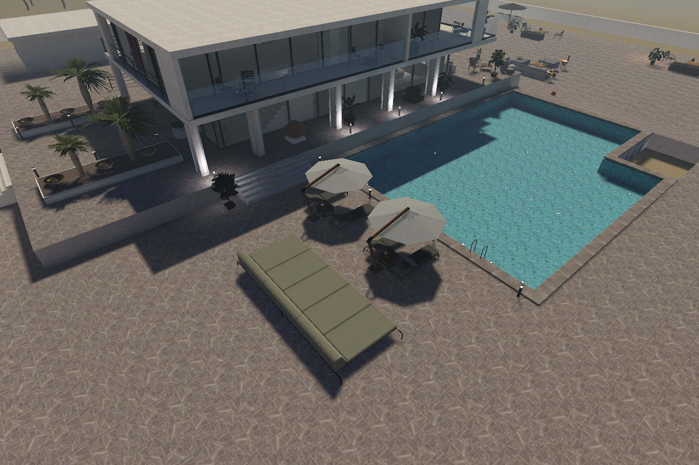
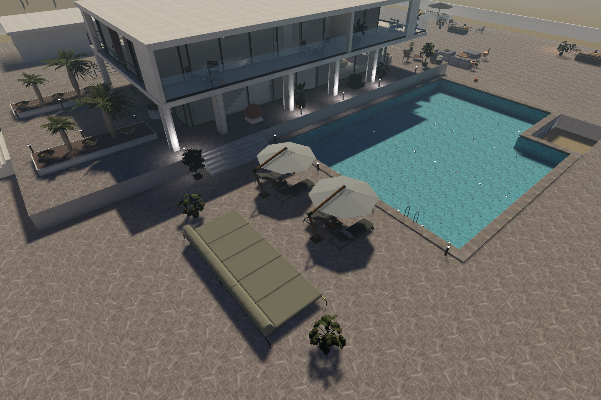
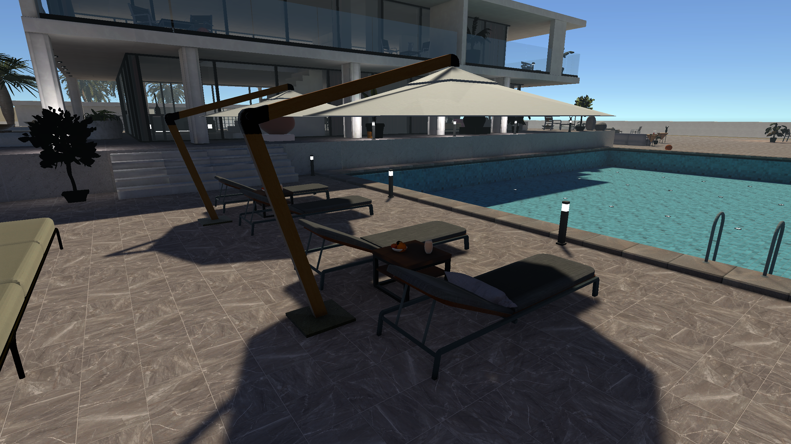
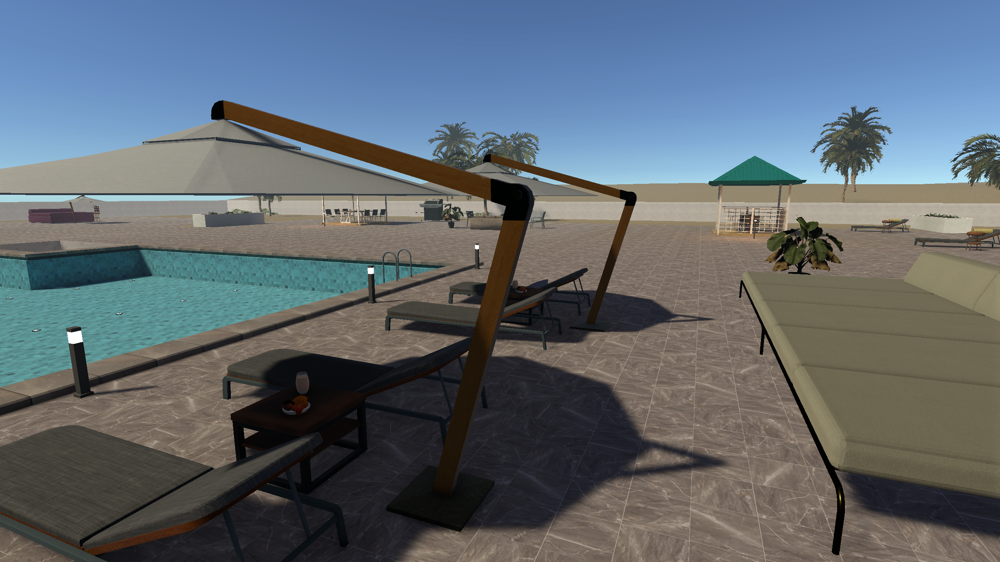

# 수영장 북쪽 휴식 공간 — 2026-09-28

후속 작업 기준: 사용자 지시에 따라 베이크와 실제 수집 거리·판정은 전체 맵 배치 후에 진행한다. 이 항목들은 다음 공간 배치를 진행하기 위한 선행 조건이 아니다.

`Assets/Modern Villa/Scenes/Beach Villa.unity`에 반영했다. 이번 범위는 북쪽 선베드와 그 뒤 휴식 좌석뿐이다. 코드 작성·씬 저장·Unity 시각 검수·Play 모드의 표본 이동 검사를 수행했다. 러버덕 수집 검증은 미완료다.

## 전체 구역 구성안

기존 씬 구조와 이전 조사 기록을 기준으로 한 연결안이다. 이번에 다른 구역은 변경하지 않았다. 외부 정원과 실내의 상세 검수는 후속 작업에서 현재 씬을 다시 측정해야 한다.

| 구역 / 용도 | 중심·보조 요소 | 진입·연결 | 탐색 후보 |
|---|---|---|---|
| 수영장 북쪽 / 수영 후 휴식 | 선베드 두 쌍, 각 쌍의 파라솔·공용 테이블, 기존 과일과 쿠션, 주스 잔 | 앞 수영장 가장자리·뒤 통로·양쪽 진입부·기존 본관 계단 | 좌석 바깥 측면, 테이블 주변, 화분 앞 |
| 본관 아래층 / 대화·식사 | 기존 소파·커피 테이블·식탁, 현재 책·식기 구성 | 기존 계단과 출입문에서 거실·식사 공간으로 | 낮은 가구 주변, 가구 측면 |
| 서쪽 식사 정원 / 야외 식사 | 기존 야외 식탁·의자·조리 설비 | 수영장 서쪽에서 정원 길로 연결 | 식탁 바깥·화단 앞 |
| 정원 정자 / 조용한 휴식 | 기존 정자·의자·보조 테이블, 식재 가장자리 | 기존 정원 길을 따라 식사 공간과 연결 | 좌석 옆·식물 가장자리 |
| 상층 라운지·테라스 / 전망·휴식 | 기존 라운지 좌석과 테이블 | 기존 실내 계단으로 연결 | 좌석 측면·테라스 안쪽 |

## 조사와 구성 의도

- 현재 열린 Unity 씬을 직접 확인하고 `PoolLevel`, `LoungeArea`의 활성 오브젝트, 프리팹 연결, 메시 구성, Collider, 월드 좌표·크기를 `survey.txt`에 기록했다. 기존 Modern Villa 데모 배치 기록도 비교했다. 원본 데모·프리팹·메시·재질은 수정하지 않았다.
- 선베드 `Lounger`는 약 0.707 × 0.627 × 2.18m이며 등받이가 북쪽에 있다. 기존 180도 방향을 유지해 수영장을 향하게 했다. 뒤쪽 `LoungerB Variant`는 실제로 여러 좌석으로 된 약 6.47m 폭의 프리팹이다. 크기를 늘려 만든 가구가 아니며 기존 크기를 유지했다.
- 파라솔은 뒤쪽 지지대에서 수영장 방향으로 차양이 뻗는 모델이다. 가구 관계에 맞춰 배치하고 실제 저부와 통로를 확인했다. 파라솔의 전체 Bounds에는 머리 위 차양도 포함되므로 Bounds 중첩만으로 관통으로 판단하지 않았다.
- 실제 주스가 든 잔 `Props/Glas`와 `Plants/PottedPlantA`는 분리된 미리보기 씬으로 형상을 확인했다. `TowelA`의 최초 미리보기는 형상이 보이지 않았으므로 사용하지 않았다. 이름만으로 수건 형태를 확정하지 않았다.
- 기존 외부 포장 상면은 이 구역에서 Y=0.05m다. 새 바닥은 추가하지 않았다. 테이블의 실제 Collider 상판을 별도로 쏴서 Y=0.45m를 확인한 뒤 잔을 얹었다. 과일을 포함한 전체 Bounds의 최고점을 상판으로 쓰지 않았다.

## 실제 변경

기존 계층·프리팹 연결·회전·크기·과일 접시·쿠션을 유지하고 다음 9개 인스턴스의 위치만 조정했다.

- `PoolLevel/Lounger`, `Lounger (1)`, `Lounger (2)`, `Lounger (3)`
- `LoungeArea/CouchTable`, `CouchTable (1)`
- `LoungeArea/GrandSunshade`, `GrandSunshade (1)`
- `LoungeArea/LoungerB Variant`

선베드는 2개씩 두 묶음이며 묶음 중심 X=-9.2, -5.2m에서 좌우로 0.85m씩 배치했다. 양쪽 모두 수영장을 향한다. 테이블은 두 좌석이 함께 사용할 위치, 파라솔 지지대는 등받이 뒤에 있다. 선베드를 Z 방향으로 0.57m 물리고 긴 휴식 좌석은 약 0.964m 뒤로 옮겼다.

`Beach Villa - Pool Lounge Detail` 아래에는 주스 잔 2개와 휴식 좌석 양 끝을 표시하는 화분 2개를 추가했다. 원본 크기를 사용했다. 잔은 기존 과일과 분리된 상판 위치에 있고, 작은 잔 자체가 보행을 방해하지 않도록 해당 인스턴스의 Collider만 비활성화했다. 화분은 기존 프리팹 Collider를 유지했다.

변경 파일은 대상 씬, `Assets/_Project/Editor/BeachVillaPoolLounge.cs`와 `.meta`, 이 보고서 폴더다. 플레이어·카메라·UI·수집 후보 데이터·조명 설정은 씬 파일 비교에서 변경되지 않았다. 기존 데이터 삭제는 0건이다. 변경 전 사본은 `BeforePoolLounge.unity.backup`이다.

## 검사 결과

- 수정 전후 동일한 카메라 위치·화각으로 전체와 양쪽 눈높이 화면을 생성하고 직접 비교했다. 기존 조명·안개 설정을 유지했다. 떠 있음, 바닥 매몰, 벽·가구 관통, 비정상적인 크기는 확인한 시점에서 발견하지 못했다. 모든 접촉면을 완전하게 검증했다는 뜻은 아니다.
- 선베드 앞 수영장 끝과의 여유: 약 0.704m → 1.274m. 파라솔 뒤부터 긴 좌석 앞까지의 전체 Bounds 기준 여유: 약 1.036m → 1.422m. 이 수치만으로 통과를 판정하지 않고 실제 플레이어로 검사했다.
- 현재 플레이어: 높이 1.8m, 반지름 0.28m, skin 0.03m, step 0.3m, 카메라 로컬 높이 1.65m, 화각 60도. 걷기 코드의 속도 2.6m/s를 사용했다.
- Edit 모드 및 Play 모드 각각 수영장 앞·뒤 통로·서쪽 진입·동쪽 진입·두 좌석 묶음 사이·기존 본관 계단의 양방향 12개 경로 통과. 평지에서 가구 위로 올라타서 통과한 경우를 제외하도록 높이 상승도 검사했다. 눈 위치의 반경 0.09m 검사에서 Collider 겹침은 없었다. 결과: `validation.txt`, `play-validation.txt`.
- 별도로 Play 모드에서 프레임별 이동을 실행했다. 뒤쪽 양 끝에서 각 약 1.94m 이동, 목표 오차 0.063m 미만, 지면 접촉 유지. `play-frames.txt` 참조. 실제 플레이어 카메라로 `play-west.png`, `play-east.png`를 촬영했다. 테스트 후 원래 플레이어·카메라 상태를 복원하고 Play를 종료했다.
- 배치 명령을 두 번째 실행했을 때 아무 변경도 하지 않음을 Unity에서 확인했다. 기존 생성 도구의 전역 배치는 실행하지 않았다. `BeachVillaExpansion`, `BeachVillaLayoutPass.Refine/Polish`, `BeachVillaGroundRepair.Apply`에는 기존 그룹 재생성 방지 조건이 있고 이번 도구가 만든 구역을 프레임마다 재생성하는 로직은 없다. 새 도구는 이 구역의 명시된 인스턴스만 수정하며, 적용 표시가 있으면 후속 수동 수정을 보존한다.

## 러버덕 후보 — 배치하지 않음

아래는 월드 좌표의 **지지면 후보**다. 러버덕 프리팹의 피벗 좌표가 아니다. 접근 지점은 주변에 도달해 살펴볼 자리이며 수집 범위가 검증된 위치가 아니다.

| 후보 | 지지면 위치 X,Y,Z | 접근 지점 X,Y,Z | 탐색 의도 |
|---|---|---|---|
| 서쪽 선베드 바깥 측면 | (-10.70, 0.05, 20.0) | (-11.4, 0.08, 20.0) | 선베드를 돌아보면 측면에서 발견 |
| 두 묶음 사이의 선베드 측면 | (-7.75, 0.05, 20.0) | (-7.2, 0.08, 20.0) | 두 구역을 오가며 시선을 낮추면 발견 |
| 서쪽 화분 앞, 잎 아래 바닥 바깥 | (-12.65, 0.05, 23.55) | (-12.0, 0.08, 22.95) | 뒤쪽 좌석과 화분을 살피며 발견 |

`BeachVillaHideLocations`는 위치·접근점과 Gizmo 표시만 가진다. 검색한 프로젝트 게임 코드에서 실제 러버덕 수집 구현을 찾지 못했다. 기존 러버덕 및 후보 데이터는 이동하지 않았다. 실제 오리 크기·수집 거리·시야 판정에 맞춰 후보를 확정해야 한다.

## 전체 배치 이후의 후속 항목

1. 러버덕 실제 프리팹과 수집 컴포넌트를 확인하고 후보의 점유 크기·접근·수집을 함께 검사한다.
2. 이전에 베이크된 조명 때문에 새 배치와 맞지 않는 그림자 또는 어두운 표면이 남을 수 있다. 이번에는 재베이크하지 않았다. 최종 배치 결정 후 조명 검토가 필요하다.
3. 이번 이동 검사는 명시된 경로의 표본 검사다. 모든 가구 사이·달리기·모든 카메라 각도·전체 맵 성능을 검증한 것은 아니다.

Unity의 `Rubber > Pool Lounge` 메뉴에서 조사·에셋 확인·적용·검사·Play 검수를 실행할 수 있다. 별도 런타임 생성 시스템은 추가하지 않았다. 적용된 오브젝트는 일반 씬 인스턴스로 직접 편집 가능하다.

## 결과 화면

