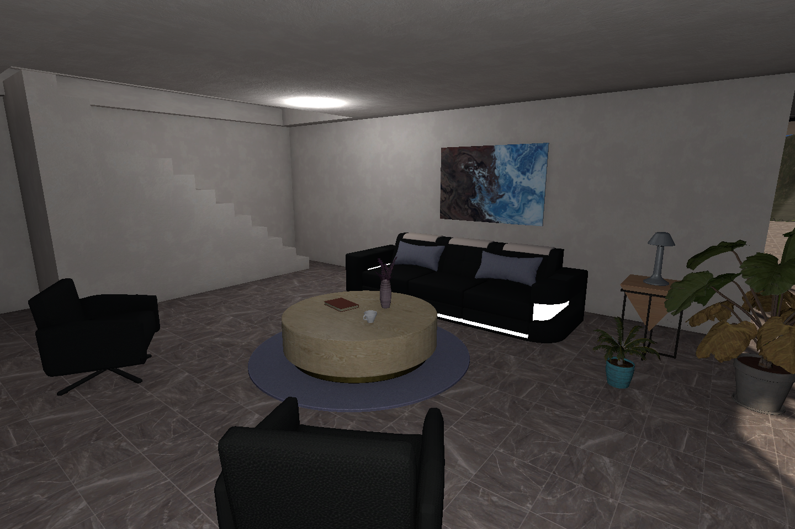
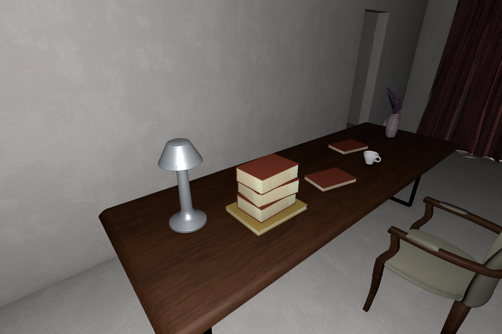
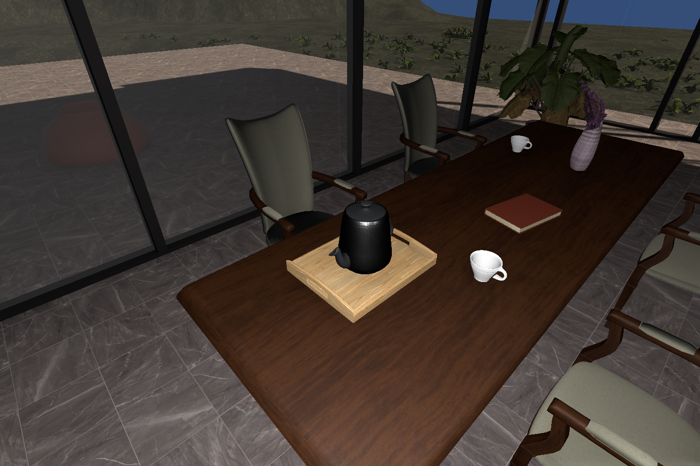

# Modern Villa — 러버덕 탐색 공간 보강

작업 전 상태는 `9caf1bf` (`feat(map): refine villa layouts and furnish Modern Villa interiors`)로 커밋하여 기존 GitHub `TeamQss11th/Rubber`의 `Map` 브랜치에 업로드했다. 이번 숨김 공간 보강은 그 이후의 로컬 변경이다.

## 반영한 내용

`Assets/Modern Villa/Scenes/Modern Villa.unity`의 기존 실내 배치를 유지하고, `Modern Villa - Search Details` 아래에 생활 소품을 추가했다. 책 4권, 소파 쿠션 2개, 작은 화분 3개, 나무 트레이와 커피포트가 대상이다. 기존 패키지의 실제 프리팹·크기·재질을 사용했다. 건축 구조, 바닥, 기존 가구와 수영장, 카메라, 게임 로직은 변경하지 않았다. Beach Villa는 이번 변경에서 제외했다.

| 장소 | 추가 배치와 탐색 방식 | 후보 중심 좌표 (월드, m) |
|---|---|---|
| 본관 위층 책상 | 참고서 더미 뒤의 빈 상판. 책상 왼쪽으로 돌아 뒤쪽을 확인 | (-5.630, 4.380, 4.980) |
| 별채 거실 소파 | 쿠션과 왼쪽 팔걸이 사이 좌석. 소파 왼쪽에서 보면 드러나는 자리 | (6.370, 0.733, 16.150) |
| 별채 아침 식사 테이블 | 트레이의 커피포트 뒤쪽 상판. 테이블 끝을 돌아 확인 | (5.580, 1.075, 19.530) |
| 별채 거실 화분 코너 | 낮은 화분 뒤, 기존 보조 탁자 앞의 바닥. 소파 앞쪽에서 내려다보기 | (9.400, 0.330, 15.640) |
| 본관 위층 독서실 | 높이가 다른 화분을 묶어 낮은 화분 뒤쪽 바닥에 탐색 지점 확보 | (-2.980, 3.635, 9.150) |
| 별채 위층 테라스 독서실 | 기존 큰 화분 옆의 작은 화분 뒤. 테라스 통로 쪽에서 측면 확인 | (7.650, 3.130, 19.630) |

후보 좌표는 **지지면보다 8cm 위의 시선 검사용 중심점**이다. 실제 러버덕의 피벗·크기에 맞춘 최종 배치 좌표가 아니며 씬에 러버덕이나 후보 마커를 생성하지 않았다. 쿠션 옆 후보는 일부만 보이는 난이도를 의도했다.

## 검사 결과

- Unity에서 사용한 책·쿠션·작은 화분·트레이·커피포트의 실제 모델과 크기를 확인했다. 미리보기가 비어 있던 수건은 사용하지 않았다.
- 책과 트레이는 실제 상판 메시, 포트는 트레이 내부 바닥 메시, 쿠션은 소파 좌석 메시를 기준으로 지지 높이를 측정했다. 트레이 손잡이의 최고 높이를 내부 바닥 높이로 사용하지 않았다.
- 방별 동일 시점 전후 이미지와 가까운 검수 이미지에서 접촉, 크기, 가구와의 관계를 확인했다. 쿠션과 소파는 의도된 접촉이다.
- 높이 약 1.8m·반경 0.28m의 임시 캡슐 검사: 주요 실내 통로 10곳과 최종 측면 관찰 위치 6곳 모두 통과. 각 지점까지의 모든 이동 경로를 연속 플레이로 검증한 것은 아니다.
- 후보 중심 주변 8cm 폭·높이의 9개 표본에 대해 실제 메시 시선을 검사했다. 접근 방향에서는 6~9개가 가려지고, 측면에서는 0개(소파는 3개)가 가려졌다. 식물의 알파 컷아웃은 메시 검사에 반영되지 않으므로 식물 결과는 보수적인 참고값이다.
- 적용 기능 재실행 시 중복 생성 없이 기존 배치를 유지했다. 저장한 씬을 다시 열어 반영 상태를 확인했다.
- 작업 전 씬 대조: 기존 오브젝트 삭제 0개. 기존 문서는 새 루트를 연결하는 목록만 변경. 신규 문서 34개. Unity 저장 과정에서 자동 변경한 조명·지형 직렬화는 작업 전 값으로 보존했다.

`validation.txt`에는 통로·관찰 위치·시선 검사와 최종 오브젝트 Bounds를 기록했다. `additions.txt`에는 원본 프리팹과 지지면 측정값, `scope-audit.json`에는 보존 대조 결과가 있다.

## 변경 파일과 확인하지 않은 항목

- 씬: `Assets/Modern Villa/Scenes/Modern Villa.unity`
- 전용 에디터 도구: `Assets/_Project/Editor/ModernVillaHideSpaces.cs` 및 `.meta`
- 검수 자료: `Docs/ModernVillaHideSpaces/`

코드 작성, 씬 반영, 제한된 시점의 시각 검수를 완료했다. 베이크, 실제 플레이어 조작, 실제 러버덕의 물리 크기와 수집 판정은 수행하지 않았다. 다음 단계에서 실제 러버덕을 배치할 때 지지면·피벗·몸체 크기와 수집 가능 거리를 맞춰야 한다. 위층 기존 닫힌 문과 출입 동작도 게임 플레이 연결 단계에서 확인해야 한다.

아래 이미지는 임시 보조광을 사용한 **배치 검수 화면**이다. 보조광과 검수 카메라는 씬에 저장하지 않았으며, 최종 베이크 또는 실제 플레이 화면이 아니다.

