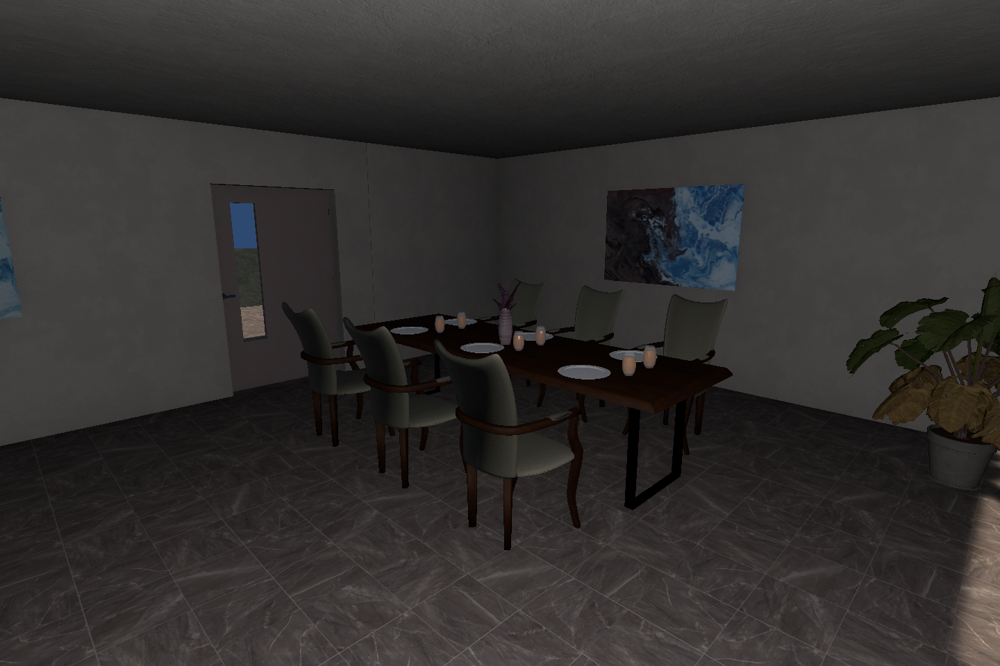
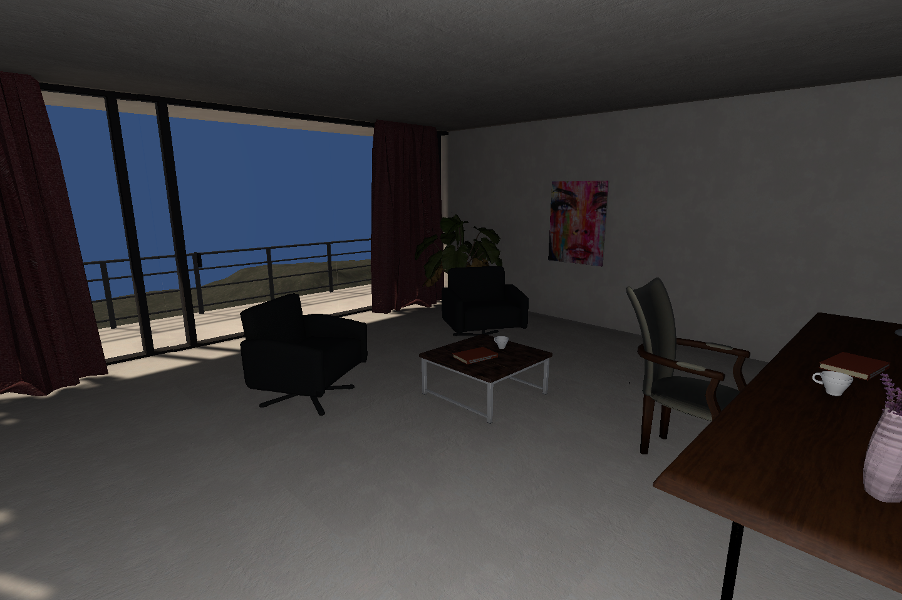
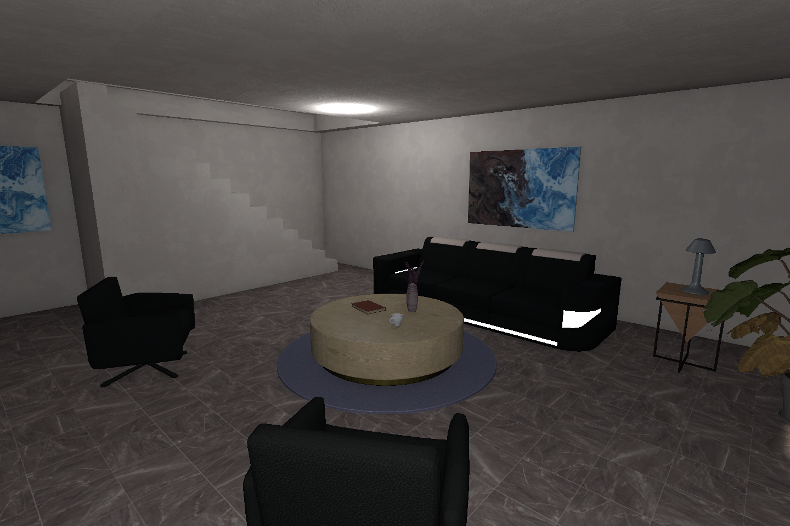
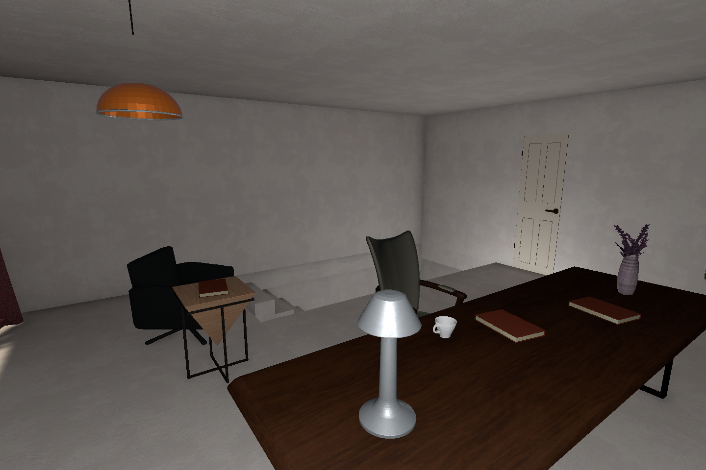

# Modern Villa 실내 가구 배치

대상은 `Assets/Modern Villa/Scenes/Modern Villa.unity`다. 이번 작업에서 Beach Villa 씬은 수정하지 않았다. 건물·벽·바닥·문·계단·수영장·기존 가구·커튼·카메라를 보존하고, 실내 가구와 소품만 추가했다. 베이크와 러버덕 수집 판정은 후속 작업으로 남겼다.

## 공간 구성

| 공간 | 구성 의도 |
|---|---|
| 본관 1층 뒤쪽 | 기존 앞쪽 소파 코너와 이어지는 가족 식사 공간. 목재 식탁, 6개 의자, 식기와 화병, 구석 식물 |
| 본관 위층 앞쪽 | 긴 작업 테이블과 책·스탠드, 창가 커피 좌석. 동쪽 이동 통로와 발코니 접근 확보 |
| 본관 위층 뒤쪽 | 두 개의 독서 의자, 낮은 테이블, 보조 탁자와 스탠드. 기존 칸막이와 출입구 유지 |
| 별채 1층 앞쪽 | 모듈형 가죽 소파, 마주 보는 의자, 원형 테이블과 작은 러그. 계단 옆 통로 유지 |
| 별채 1층 뒤쪽 | 간단한 아침 식사와 독서를 위한 4인 테이블. 창과 출입구에서 가구를 띄워 배치 |
| 별채 위층 앞쪽 | 작업용 테이블과 독서 의자. 계단 도착 지점과 뒷방 출입구 앞 비우기 |
| 별채 위층 뒤쪽 | 기존 그림과 커튼을 활용한 독서 코너. 테라스 쪽 통행 공간 확보 |

사용한 실제 에셋은 기존 Modern Villa 패키지의 가죽 좌석 모듈, LeatherSeat, DiningTableB Variant, DiningChairB Variant, CouchTableB/F, SideTable Variant, CarpetB, PottedPlantA, 책·컵·화병·식기·그림·탁상 스탠드다. 원래 크기와 공유 재질을 유지했다. 침대·주방장·수납장 프리팹을 찾지 못했으므로 다른 물건으로 이를 흉내 내지 않았다.

## 변경 파일과 오브젝트

- `Assets/Modern Villa/Scenes/Modern Villa.unity`
- `Assets/_Project/Editor/ModernVillaInterior.cs` 및 Unity 생성 `.meta`
- 이 문서 폴더의 조사·미리보기·전후 비교·검사 기록

씬의 `Modern Villa - Interior Furnishing` 아래 7개 용도별 그룹을 만들었다. 87개 프리팹 인스턴스에는 모듈 소파의 개별 좌석과 팔걸이, 접시·잔 같은 작은 소품도 포함된다. 개별 목록·원본 에셋 경로·위치·크기는 `additions.txt`에 기록했다. 오브젝트 수가 아닌 생활 공간의 구성과 통로를 기준으로 배치했다.

## 검사와 결과

- 기존 씬의 본관·별채, 층별 벽·출입구·계단과 기존 배치를 조사했다. 본관 1층 소파와 별채 테라스 식탁은 보존했다.
- 새로 사용하는 가구 모델을 미리보기에서 확인했다. 미리보기가 정상 표시되지 않은 CouchD와 Couch Group B는 사용하지 않았다.
- 바닥 지지면을 개별 측정했다: 본관 1층 0.75m, 위층 약 3.555m, 별채 1층 0.25m, 위층 3.05m. 상판 위 소품은 각 테이블 실제 Bounds와 충돌 표면을 대조하고 화면으로 확인했다.
- 벽·계단과 주요 가구의 Bounds 침범 후보는 검사에서 발견되지 않았다. 소파 모듈끼리의 접촉과 러그 위 원형 테이블은 의도된 접촉이다.
- 1.8m 높이, 반경 0.28m의 임시 캡슐로 주요 실내 통로 10개를 검사했고 모두 통과했다. 이는 이 씬에 연결된 실제 플레이어 검증이 아니다. 현재 씬에서 CharacterController를 발견하지 못했다.
- 7개 실내 눈높이 시점 및 위에서 본 층별 배치를 수정 전후 동일 조건으로 확인했다.
- 적용 기능을 재실행해 중복 추가 없이 기존 편집을 보존하는 것을 확인했다.
- 새 배치 도구는 해당 씬에서만 적용되며 런타임 생성 코드를 추가하지 않는다. 기존 VillaMapBuilder/VillaEstateBuilder는 다른 작업용 씬을 대상으로 한다.

## 화면의 의미와 남은 항목

아래 이미지는 **Unity 배치 검수 화면**이다. 실내 형태 확인을 위해 캡처 중에만 임시 보조광을 사용했으며 씬에 저장하지 않았다. 검수용 카메라에서 오래된 오클루전 데이터의 누락을 피하도록 오클루전 컬링을 껐다. 원래 게임 카메라와 조명 설정은 바꾸지 않았다. 따라서 최종 베이크 결과 또는 실제 플레이 화면으로 해석하면 안 된다.

씬 반영과 배치 시각 검수를 완료했다. 실제 플레이어 이동, 모든 카메라 각도, 수집 거리, 조명/오클루전 베이크는 검증하지 않았다. 기존 문이 닫힌 곳에는 새 문 동작을 만들지 않았다. 전체 배치가 끝난 뒤 해당 항목들을 함께 검토하면 된다.

최종 백업 대조: 기존 씬 문서에서 변경된 것은 새 그룹을 연결하는 루트 목록 한 개뿐이다. 기존 오브젝트 삭제 0개, 신규 문서 190개(프리팹 87개와 그룹 8개에 대응). Unity 저장 시 자동으로 바뀐 지형·조명 직렬화 기록은 작업 전 값으로 보존했다. 저장된 씬을 다시 열어 가구가 유지되는 것도 확인했다.
